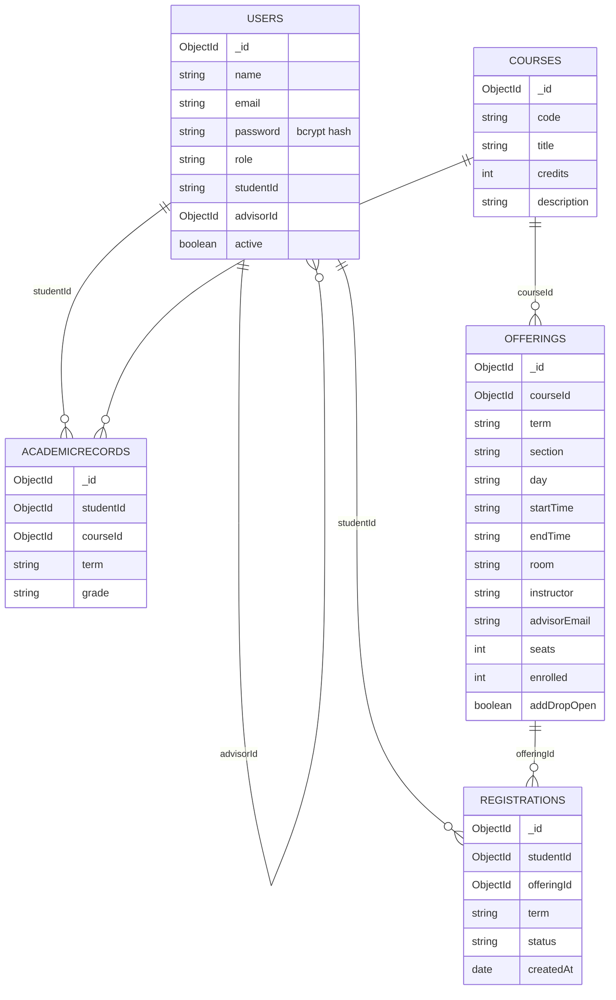

# Course Registration System

A MERN university course registration project with admin, advisor and student dashboards.

Features: role-based login, admin account management, course sections, live seat
counts, advisor registration, eligibility explanations, student academic histories,
credits earned and the manual add/drop form workflow.

## Setup

Requires Node.js/npm and MongoDB Atlas (or a local replica set for transactions).
Run from this project directory:

```sh
npm install
npm install --prefix client
```

Copy `.env.example` to `.env` (PowerShell: `Copy-Item .env.example .env`).
Set `MONGODB_URI` to an empty database and `JWT_SECRET` to your own secret.
Then run:

```sh
npm run seed
npm start
```

In another terminal, from the same directory:

```sh
npm run dev --prefix client
```

Open http://localhost:5173. The API runs on http://localhost:3000.
PowerShell users can use `npm.cmd` if script execution policy blocks `npm`.

## Seed data and login accounts

```text
25 students, 4 advisors, 1 admin created
18 courses, 26 sections created for term 2026-1
312 completed-course records created
```

| Role | Email | Password |
| --- | --- | --- |
| Admin | admin@stamford.edu | password123 |
| Advisor | advisor@stamford.edu | password123 |
| Student | sami@stamford.edu | password123 |

All names, IDs and grades are invented. Login emails are demo aliases.
Students have IDs DEMO2026001?DEMO2026025 and are assigned to four advisors.
Mira Maple (sami@stamford.edu) failed ITE240; Maya Linden failed ITE441.
Academic histories span 2023-1 through 2025-2. Registrations start empty.
The seed refuses populated databases and never deletes existing data.
A failed seed may leave partial data; use a fresh empty database before retrying.

## Registration rules

Only sections offered in the selected term appear. Passed courses are excluded;
failed courses are flagged for retake and listed first. Full sections and timetable
clashes are blocked with explanations. These checks also run when registering,
and MongoDB transactions keep registration and seat counts consistent.
Prerequisite checks are excluded because the project document does not require them.

Advisors set the add/drop window and closing date in the section form. Students
see open/closed status and the closing date. Open windows require a future date
and close automatically after the deadline (end of the selected day in Bangkok).
Existing windows without a deadline stay closed until the advisor supplies one.
The advisor's Finalize term button locks new registrations and removals for the
selected term on the server and closes its add/drop requests. Finalisation
requires confirmation and cannot be undone through the dashboard.
Students
download the form, complete and sign it, then email their assigned advisor using
`Add/Drop Request - <Student ID> - <Course Code>`. The advisor updates registration
manually. The form is in `client/public/add-drop-request-form.pdf`.

## Code and checks

`models/` defines data, `routes/` applies authorization, `controllers/` handles
requests and `services/` contains registration rules and transactions.
React dashboards share simple layout and academic-history components. Fetch calls
use `client/src/api.js`. Passwords are bcrypt hashes; protected endpoints check
current account roles and students can only read their own histories.

`npm test` runs isolated checks without changing MongoDB.
`npm run build --prefix client` checks the React production build.
The database diagram is included below.

## Submission items still needed

Course codes and titles use the supplied 2025 IT curriculum; credit values are
derived from its category totals (four credits per subject). Section times, rooms,
identities and grades are synthetic demo data.
Add the group number, five members with student IDs and roles, and screenshots
of all three dashboards. Prepare the group report and individual peer evaluations
required by the document. Disclose AI assistance and how the result was verified.

## Database diagram

Student names and IDs are invented. `User.password` stores a bcrypt hash.
Academic records and registrations reference student account ObjectIds.



Emails and student IDs are unique. Sections are unique by course, term and
section number. Registrations are unique by student and offering. Remaining
seats are `seats - enrolled`; seat changes and registrations share a transaction.
Students are stored as user accounts. Course codes and titles are drawn from the supplied 2025 IT curriculum.

## Curriculum source

Source: `BSC_CIS_IT curriculum 2025_update 9_July.docx`, supplied by the group.
The curriculum lists 40 credits for 10 general-education subjects and 100 credits
for 25 professional subjects; the seed derives four credits per selected subject.
Prerequisite annotations and year indicators are not part of course titles.
Descriptions, schedules, student histories and grades are synthetic.

| Code | Title | Credits |
| --- | --- | --- |
| BSC101 | Introduction to Computing and Intelligence Systems | 4 |
| BSC103 | Introduction to Data structures and algorithms analysis | 4 |
| ITE220 | Web Development II | 4 |
| MAT101 | Fundamentals of Algebra | 4 |
| ENG101 | Introduction to Academic Writing | 4 |
| ITE221 | IT Programming I | 4 |
| ITE222 | IT Programming II | 4 |
| ITE441 | Database Management Systems I | 4 |
| BSC104 | Computer Organization | 4 |
| ITE240 | Operating Systems | 4 |
| ITE475 | Network I | 4 |
| MAT102 | Business Mathematics with MS Excel | 4 |
| BSC102 | Discrete mathematics structures | 4 |
| STA101 | Statistics for Everyday Life and Beyond | 4 |
| ENG102 | Academic Writing | 4 |
| BSC321 | System Analysis, Design, and Implementation | 4 |
| BSC224 | Introduction to Data Science | 4 |
| ITE420 | Information Assurance and Security I | 4 |
